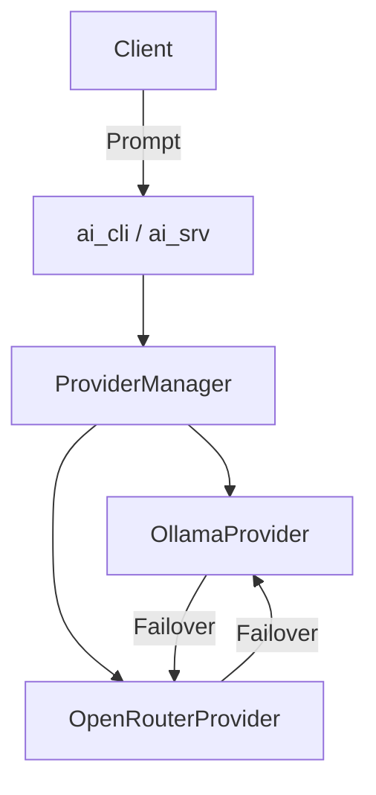

# ai_txt-system

Consolidated AI text generation system with Ollama and OpenRouter support.

## Documentation Overview

This project provides a consolidated interface for interacting with various LLM providers.
- **`ai_cli`**: Command-line interface for simple prompts and provider selection.
- **`ai_srv`**: Microservice using Crow to provide a REST API for LLM interaction.

The system handles multiple models per provider and includes failover logic to switch between models and providers if errors occur.

## Architecture Overview

The system is built on a provider-based architecture:
- `ILlmProvider`: Interface for all LLM services.
- `OllamaProvider`: Implementation for Ollama API.
- `OpenRouterProvider`: Implementation for OpenRouter API.
- `ProviderManager`: Orchestrates requests, handles preferred provider selection, and implements failover logic.



## Build

```bash
cmake -S . -B build -DCMAKE_BUILD_TYPE=Release
cmake --build build -j"$(nproc)"
```

## Usage

### CLI

```bash
./build/ai_cli --provider ollama "Tell me a joke"
```

### Server

```bash
./build/ai_srv
```

Post a prompt:
```bash
curl -X POST http://localhost:18080/api/v1/prompt \
     -H "Content-Type: application/json" \
     -H "X-LLM-Provider: openrouter" \
     -d '{"prompt": "Hello"}'
```
