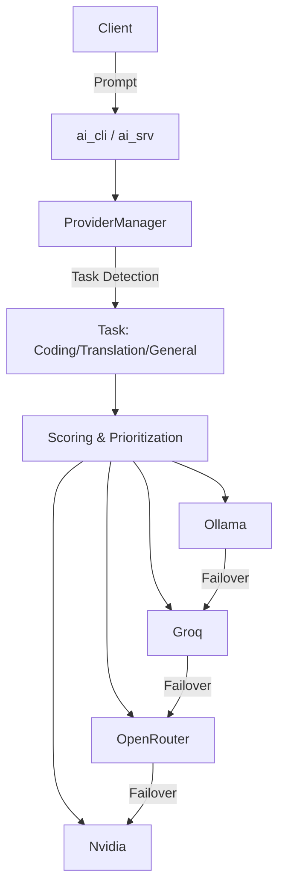

# ai_txt-system

Consolidated AI text generation system with support for Ollama, OpenRouter, GROQ, and NVIDIA.

## Documentation Overview

This project provides a consolidated interface for interacting with various LLM providers.
- **`ai_cli`**: Command-line interface for simple prompts and provider selection.
- **`ai_srv`**: Microservice using Crow to provide a REST API for LLM interaction.

The system features **Task-Based Model Selection**, which automatically detects the intent (e.g., Coding, Translation) and selects the most appropriate model. It also includes comprehensive failover logic to switch between models and providers.

## Architecture Overview

The system is built on a provider-based architecture:
- `ILlmProvider`: Interface for all LLM services.
- `OllamaProvider`: Implementation for Ollama API (local or remote).
- `OpenRouterProvider`: Implementation for OpenRouter API (aggregator).
- `GroqProvider`: Implementation for GROQ API (high-performance).
- `NvidiaProvider`: Implementation for NVIDIA API (enterprise).
- `ProviderManager`: Orchestrates requests, detects tasks, scores model candidates, and implements failover logic.


```mermaid
graph TD
    A[Client] -->|Prompt| B[ai_cli / ai_srv]
    B --> C[ProviderManager]
    C -->|Task Detection| T[Task: Coding/Translation/General]
    T --> SC[Scoring & Prioritization]
    SC --> P1[Ollama]
    SC --> P2[OpenRouter]
    SC --> P3[Groq]
    SC --> P4[Nvidia]
    P1 -->|Failover| P3
    P3 -->|Failover| P2
    P2 -->|Failover| P4
```

## Build

This project uses the [Conan](https://conan.io/) package manager.

```bash
# 1. Install dependencies
conan install . --output-folder=build --build=missing

# 2. Configure and build
cmake -S . -B build -DCMAKE_BUILD_TYPE=Release -DCMAKE_TOOLCHAIN_FILE=build/conan_toolchain.cmake
cmake --build build -j"$(nproc)"
```

## Docker deployment

You can easily deploy `ai_srv` via Docker using the pre-built binary. The `data/Dockerfile` provides the build instructions.

```bash
# Build the image
docker build -t ai_txt -f data/Dockerfile .

# Run the container with a mounted configuration directory
docker run -d \
  --name ai_txt \
  -p 18080:18080 \
  -v /home/Docker/webapp/etc/ai:/webapp/etc/ai \
  ai_txt
```

## Usage

### CLI (`ai_cli`)

The CLI tool allows sending prompts directly to configured LLM providers.

```bash
./build/ai_cli [OPTIONS] <PROMPT>
```

**Options:**
- `--provider <ollama|openrouter|groq|nvidia>`: Forces the use of a specific provider. If omitted, the system tries all providers in order of their task suitability (failover).
- `--env <path>`: Specify a custom path to the environment file (default: `data/private.env`).
- `--help, -h`: Show usage information.

**Examples:**
```bash
# Direct prompt (Task Detection: Coding)
./build/ai_cli "Erstelle eine C++23 Klasse für einen Buffer"

# Force provider
./build/ai_cli --provider groq "Explain quantum entanglement"
```

### Server (`ai_srv`)

The microservice provides a REST API on port `18080`.

```bash
# Basic startup
./build/ai_srv

# With custom environment file
./build/ai_srv --env /path/to/private.env
```

**Endpoint:** `POST /api/v1/prompt`

**Request Body (JSON):**
- `prompt` (string): The text to process.
- `provider` (string, optional): 'ollama', 'openrouter', 'groq', or 'nvidia'.

**Headers:**
- `X-LLM-Provider`: (optional) 'ollama', 'openrouter', 'groq', or 'nvidia'. Takes precedence over JSON body.

**Example:**
```bash
curl -X POST http://localhost:18080/api/v1/prompt \
     -H "Content-Type: application/json" \
     -H "X-LLM-Provider: openrouter" \
     -d '{"prompt": "Tell me a joke"}'
```
