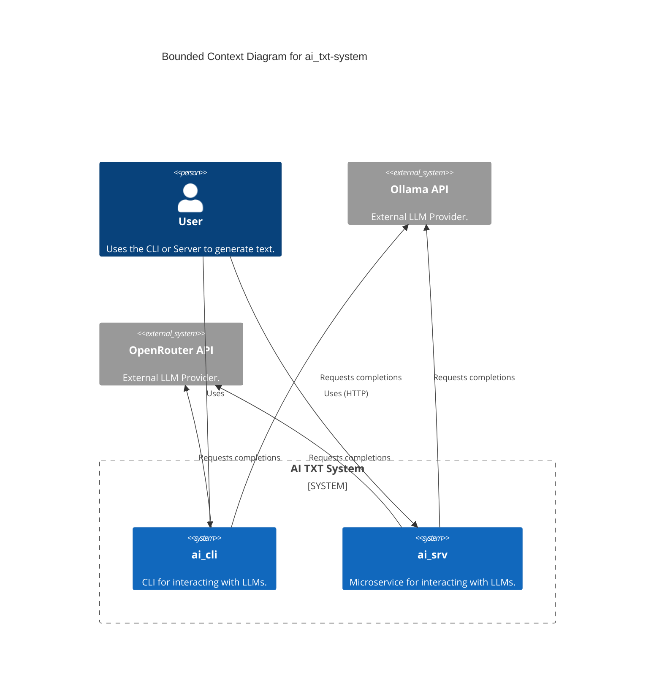
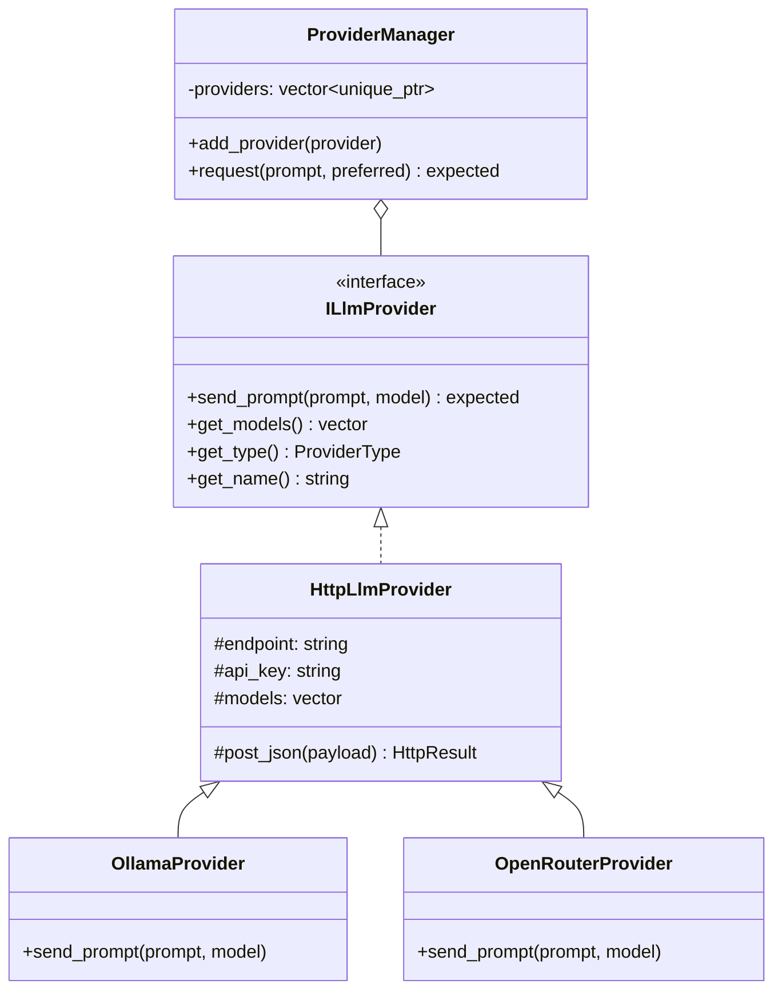
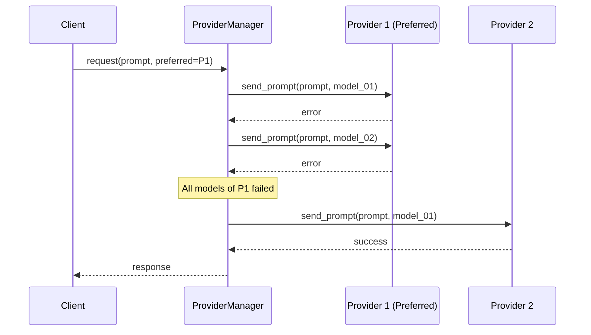

# Architecture Overview

This document describes the architecture of the `ai_txt-system`.

## Bounded Context Diagram

```mermaid
C4Context
    title Bounded Context Diagram for ai_txt-system
    
    Person(user, "User", "Uses the CLI or Server to generate text.")
    System_Boundary(ai_system, "AI TXT System") {
        System(ai_cli, "ai_cli", "CLI for interacting with LLMs.")
        System(ai_srv, "ai_srv", "Microservice for interacting with LLMs.")
    }
    
    System_Ext(ollama, "Ollama API", "External LLM Provider.")
    System_Ext(openrouter, "OpenRouter API", "External LLM Provider.")
    
    Rel(user, ai_cli, "Uses")
    Rel(user, ai_srv, "Uses (HTTP)")
    Rel(ai_cli, ollama, "Requests completions")
    Rel(ai_cli, openrouter, "Requests completions")
    Rel(ai_srv, ollama, "Requests completions")
    Rel(ai_srv, openrouter, "Requests completions")
```

## Class Diagram

```mermaid
classDiagram
    class ILlmProvider {
        <<interface>>
        +send_prompt(prompt, model) expected
        +get_models() vector
        +get_type() ProviderType
        +get_name() string
    }
    
    class HttpLlmProvider {
        #endpoint: string
        #api_key: string
        #models: vector
        #post_json(payload) HttpResult
    }
    
    class OllamaProvider {
        +send_prompt(prompt, model)
    }
    
    class OpenRouterProvider {
        +send_prompt(prompt, model)
    }
    
    class ProviderManager {
        -providers: vector~unique_ptr~
        +add_provider(provider)
        +request(prompt, preferred) expected
    }
    
    ILlmProvider <|.. HttpLlmProvider
    HttpLlmProvider <|-- OllamaProvider
    HttpLlmProvider <|-- OpenRouterProvider
    ProviderManager o-- ILlmProvider
```

## Failover Sequence

```mermaid
sequenceDiagram
    participant C as Client
    participant PM as ProviderManager
    participant P1 as Provider 1 (Preferred)
    participant P2 as Provider 2
    
    C->>PM: request(prompt, preferred=P1)
    PM->>P1: send_prompt(prompt, model_01)
    P1-->>PM: error
    PM->>P1: send_prompt(prompt, model_02)
    P1-->>PM: error
    Note over PM: All models of P1 failed
    PM->>P2: send_prompt(prompt, model_01)
    P2-->>PM: success
    PM-->>C: response
```
